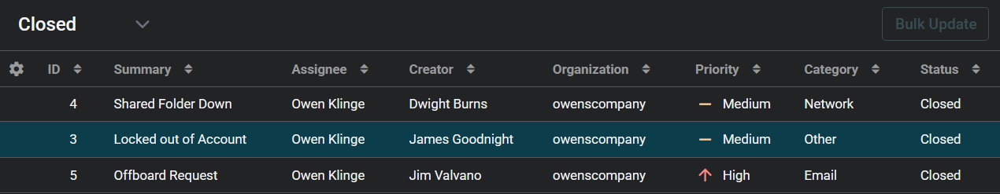
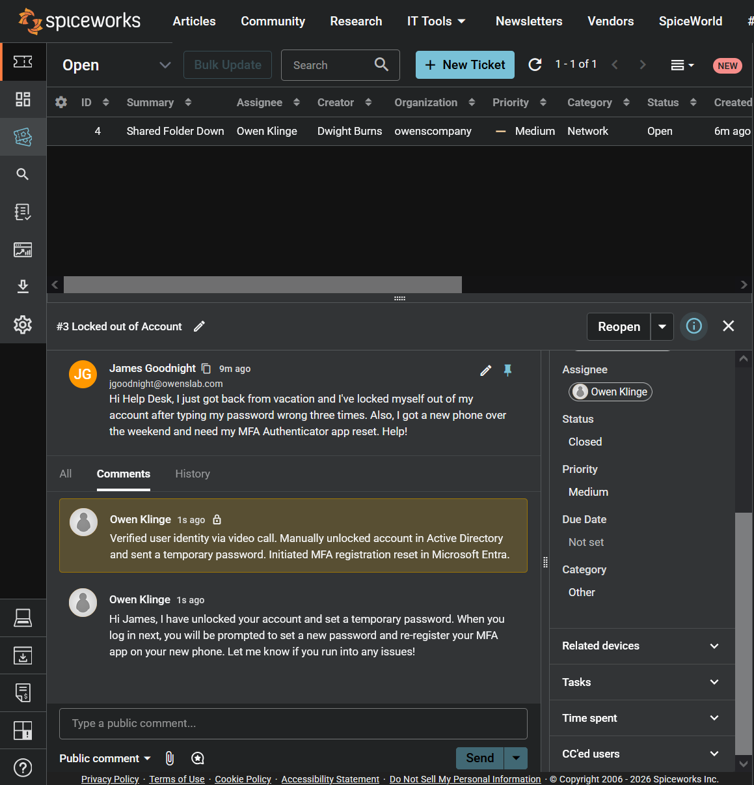
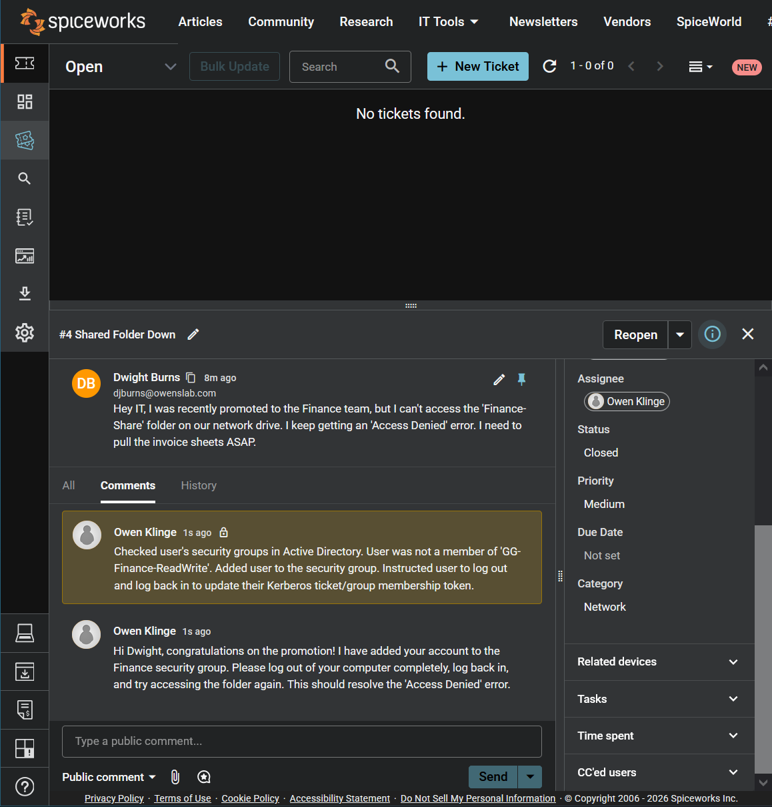
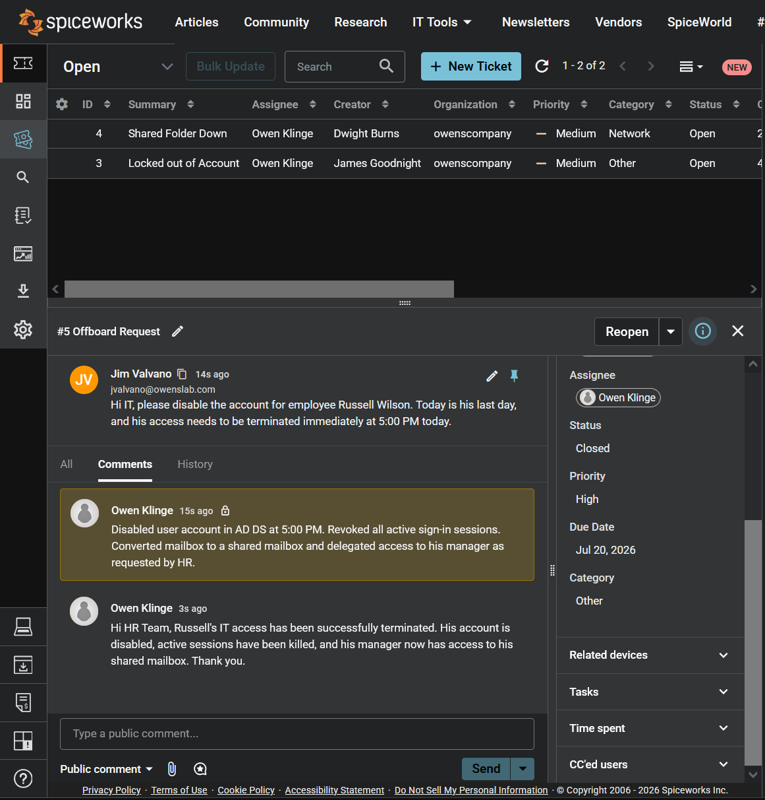
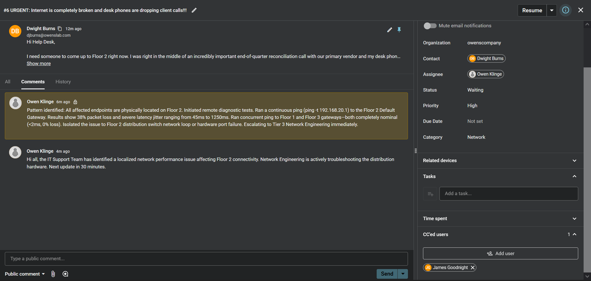
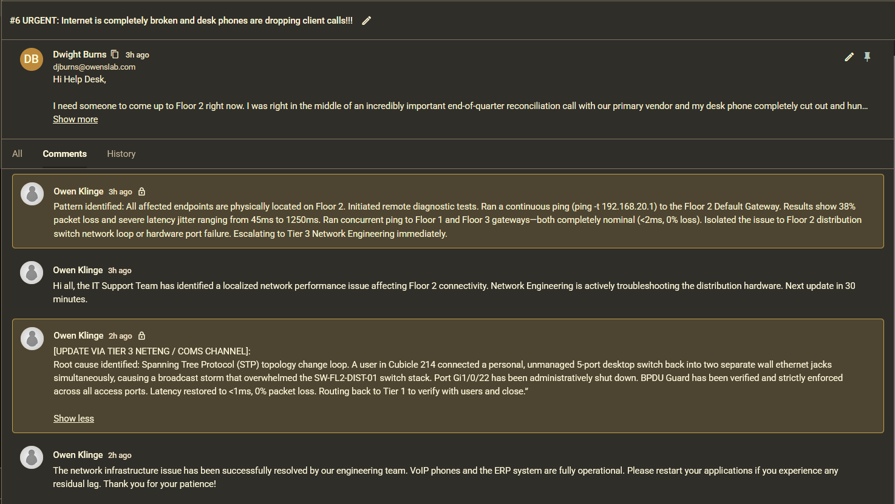
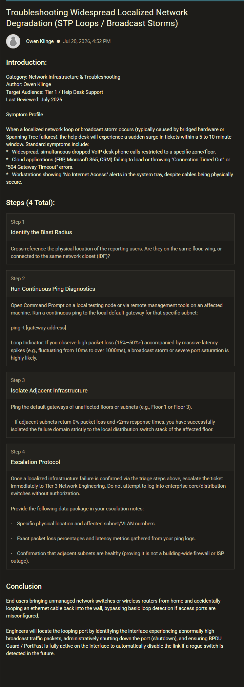

# Help Desk & IT Support Ticketing Lab

## Project Overview
This project demonstrates a hands-on simulation of an enterprise IT Support Help Desk environment utilizing **Spiceworks Cloud Help Desk**. The purpose of this lab is to replicate the end-to-end lifecycle of IT service requests, practice strict Service Level Agreement (SLA) prioritization, and develop professional, user-facing communications alongside detailed internal technical documentation. 

By acting as both the end-user (generating requests) and the IT Support Agent (assessing and resolving issues), this lab simulates real-world desktop support, identity management, and access control workflows.

## Tools & Environment
*   **Ticketing Platform:** Spiceworks Cloud Help Desk
*   **Core Concepts:** Ticket Lifecycle, SLA Management, Internal Knowledge Documentation, Active Directory/Entra ID Simulation, Customer Service Communication

---

## Ticket Overview
Below is the centralized agent view showing the status, priority levels, and assignments of the closed service requests handled during this lab.

### Agent Workspace

---

## Lab Scenarios & Resolution Walkthroughs

### Scenario 1: Password Reset & MFA Lockout
*   **Priority:** Medium (User operational block, non-emergency)
*   **User Issue:** End-user locked out of their primary account after multiple incorrect password attempts following vacation. User also acquired a new mobile device and requires an MFA/Authenticator application registration reset.

#### Technical Resolution & Documentation
**Initial Assessment:** Ticket assigned to agent; priority escalated to Medium to ensure minimal user downtime.

---

### Scenario 2: Shared Network Folder Access (Permissions)
*   **Priority:** Low/Medium (Role transition/Onboarding adjustment)
*   **User Issue:** A recently promoted employee requested access to the restricted network share folder (`Finance-Share`) and reported receiving an "Access Denied" error when attempting to pull necessary departmental reporting sheets.

#### Technical Resolution & Documentation
**Initial Assessment:** Assigned to agent workflow. Verified management approval for the access modification.

---

### Scenario 3: Urgent Employee Offboarding Request
*   **Priority:** High (Security compliance / Time-sensitive SLA)
*   **User Issue:** An urgent request submitted by Human Resources to deprovision an employee account and revoke all corporate infrastructure access exactly at 5:00 PM due to an offboarding action.

#### Technical Resolution & Documentation
**Initial Assessment:** Escalated immediately to High priority. Due date set explicitly for 5:00 PM to meet security compliance guidelines.

---

### Scenario 4: Critical Network Outage & Tier 3 Escalation
*   **Priority:** High (High business impact, floor-wide outage)
*   **Summary:** Handled a localized, high-impact network degradation incident on Floor 2. Identified pattern across multiple user tickets, isolated the failure domain using baseline CLI diagnostics (`ping` / `tracert`), escalated with actionable technical data to Tier 3 Network Engineering, and published a post-incident Knowledge Base Article.

**User Message**

"Hi Help Desk,

I need someone to come up to Floor 2 right now. I was right in the middle of an incredibly important end-of-quarter reconciliation call with our primary vendor and my desk phone completely cut out and hung up on them. Now the screen on my phone just says 'Discovering...' and won't give me a dial tone.

On top of that, I am trying to pull up the ERP system to process today's invoice batch, but the web page just spins continuously for a few minutes before giving me a 'Connection Timed Out' error.

I thought it was just my computer, but Mark in the cubicle right next to me (Cube 205) is having the exact same issue and can't load anything either. Is the entire network down today? Please fix this ASAP, we have a hard deadline by 4:00 PM to get these numbers submitted!"

#### Stage 1: Initial Assessment & Escalation
*   **Actions Taken:** Received incoming report from Finance (#1084). Recognized floor-wide pattern, executed remote continuous ping tests to verify packet loss (38%) and latency spikes, issued an initial public broadcast update to affected users, and routed the ticket to Tier 3 Network Engineering with diagnostic findings.

*Screenshot showing initial user report, Tier 1 diagnostic internal notes, user-facing broadcast update, and escalation status.*

#### Stage 2: Tier 3 Resolution & Ticket Closure
*   **Actions Taken:** Network Engineering identified a Spanning Tree Protocol (STP) loop caused by an unmanaged switch in Cube 214. Tier 3 logged the root cause internal note. Sent final resolution update to Floor 2 staff verifying phone/ERP restoration and marked ticket as Closed.

Screenshot showing Tier 3 engineering resolution notes, final customer-facing resolution reply, and ticket marked as Resolved/Closed.*

### Spiceworks Knowledge Base Integration (KBA)

Following the incident, created an internal Knowledge Base Article (**KB-0042**) in Spiceworks. This equips Tier 1 technicians to rapidly identify broadcast storm symptoms, execute continuous ping isolation steps, and escalate with standardized diagnostic logs.

*Published Knowledge Base Article inside Spiceworks KB module outlining symptoms, CLI commands, and escalation protocols for network loops.*

## Core Competencies Demonstrated
*   **SLA Awareness & Incident Management:** Correctly categorized and prioritized incoming tickets based on urgency, business impact, and security risks—ensuring critical floor-wide outages received immediate, high-priority routing to protect operational uptime.
*   **Systematic Network Diagnostics:** Utilized baseline CLI tools (`ping`, `tracert`) and pattern recognition to isolate failure domains, distinguishing localized network infrastructure loops from individual endpoint hardware failures.
*   **Structured Tier 3 Escalation:** Executed seamless escalation workflows by compiling clean, data-driven diagnostic logs (packet loss %, latency metrics, boundary scopes) for specialized Network Engineering teams, significantly accelerating root-cause resolution.
*   **Professional Empathy & Communication:** Maintained clear, accessible, and jargon-free communication during direct user interactions and floor-wide broadcast updates, keeping non-technical staff reassured and informed during high-stress outages.
*   **Knowledge Management & Technical Literacy:** Documented precise, granular troubleshooting steps in internal IT logs and authored post-incident Knowledge Base Articles (KBAs) to standardize repeatable triage procedures across the entire support team.
